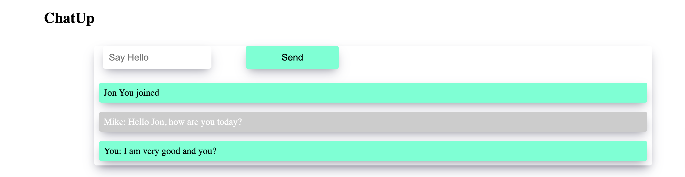

ChatUp is a real time messaging application that allows users who are connected to the server to ccommunicate in realtime.


.png)
.png)


## Built With

- Html, CSS JavaScript, socket.io;
- Visual Studio, Git, & GitHub;

## Getting Started

To run this project, you only need a computer with a browser (like Google Chrome, Mozilla Firefox, Microsoft Edge, Apple Safari, etc.) installed, and follow these steps:

1. In your terminal, in the folder of your preference, type the following bash command to clone this repository:

```sh
git@github.com:fortuneonyeka/Chat-App.git
```

2. Now that you have already cloned the repo run the following commands to get the project up and running:
```sh
cd Chat-App
npm install
npm run devStart
lunch the html with Golive
for testing: open the browser in two places.
```

## Author

👤 **Ihedoro Fortunatus O**

- GitHub: [@fortuneonyeka](https://github.com/fortuneonyeka)
- Twitter: [@onyekafortune](https://twitter.com/onyekafortune)
- LinkedIn: [Ihedoro Fortunatus](https://www.linkedin.com/in/fortunatus-ihedoro/)

## 🤝 Contributing

Contributions, issues, and feature requests are welcome!

## Show your support

Give a ⭐️ if you like this project!